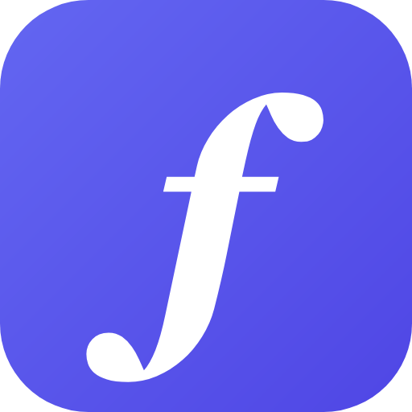
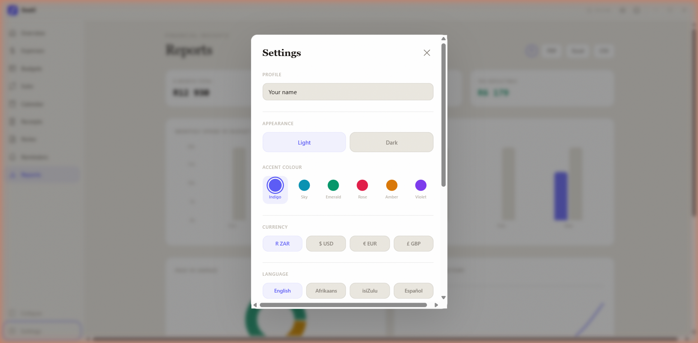
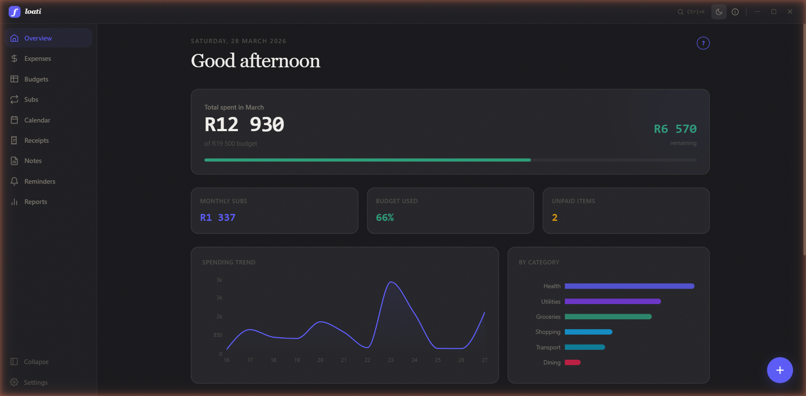
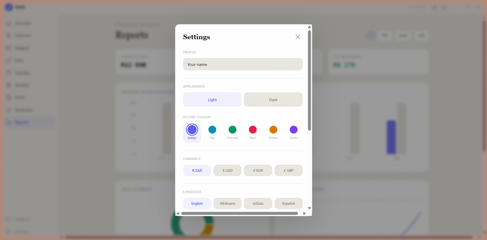
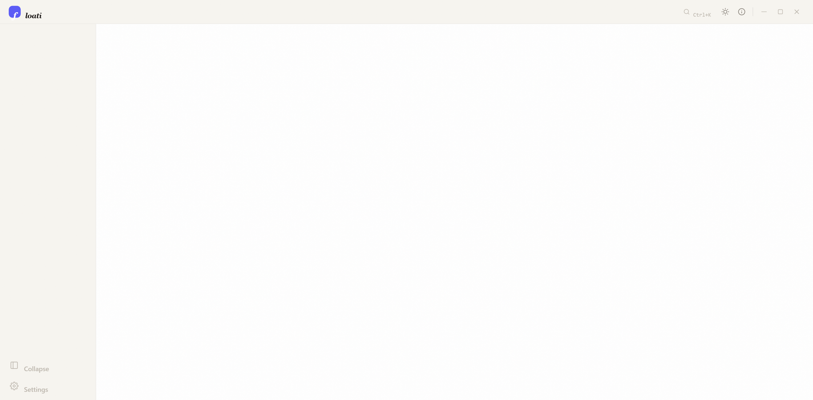
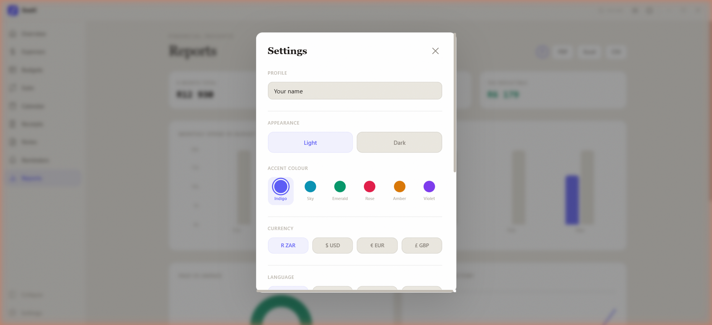

<p align="center">
  
</p>

<h1 align="center">Floati</h1>

<p align="center">
  <strong>Privacy-first personal finance manager</strong><br>
  <sub>100% offline. Your data never leaves your device.</sub>
</p>

<p align="center">
  
  
  
  
  
</p>

<p align="center">
  
</p>

---

## Why Floati?

Every finance app wants your data. They want you to sign up, sync to the cloud, and trust them with your most sensitive information.

**Floati is different.** Everything runs on your device. No cloud. No accounts. No telemetry. Your database is a single file on your computer. Export it, back it up, move it, or delete it.

---

## Features

### Dashboard
Your financial overview at a glance. Total spending, budget usage, subscription costs, unpaid items, spending trends, and recent transactions.

<p align="center">
  
</p>

### Expenses
Full CRUD with paid/unpaid tracking, category tagging, search, and filters. Hover any row to edit or delete.

<p align="center">
  
</p>

### Budgets
Create envelope budgets per category. Visual progress bars show how much you've spent vs your limit. Colour-coded cards with percentage tracking.

### Subscriptions
Track recurring payments (Netflix, Spotify, gym, etc). Toggle active/paused, see monthly and yearly totals, filter by status.

### Calendar
See all your financial events on one timeline. Expenses, subscription due dates, and reminders shown as colour-coded dots. Click a day to see details.

### Receipts
Upload receipt images with merchant, amount, date, and category. Stored locally. Native file picker on Windows.

### Notes
Scratchpad for financial notes, tax deductions, savings goals. Tag and search your notes.

### Reminders
Set reminders for bills and deadlines. System notifications fire when reminders are due (while app is running or in system tray).

### Reports & Export
Charts built from real data (last 6 months). Export to:
- **PDF** with styled formatting
- **Excel** (.xlsx) with multiple sheets
- **CSV** for raw data
- **JSON** full backup for device migration

<p align="center">
  
</p>

---

## Design

### 6 Accent Themes
Indigo, Sky, Emerald, Rose, Amber, Violet. The taskbar icon changes colour to match.

<p align="center">
  
</p>

### Dark & Light Mode
Full dark mode with carefully tuned contrast. Persists between sessions.

### 7 Languages
English, Afrikaans, isiZulu, Espanol, Francais, Portugues, Deutsch

### Collapsible Sidebar
Full labels or icon-only rail. Your preference persists.

### Help Tips
Every screen has a **?** button explaining how it works.

### Onboarding
7-step interactive tour for new users. Enter your name, pick your theme, try the UI. Replay anytime from Settings.

### Command Palette
Press `Ctrl+K` to search expenses, navigate screens, or take quick actions.

---

## System Tray

When you close the window, Floati minimises to the system tray instead of quitting. Double-click the tray icon to restore. Right-click for Show/Quit.

Reminders fire as Windows notifications while the app is in the tray.

---

## Tech Stack

| Layer | Technology |
|---|---|
| Framework | [Tauri 2.0](https://tauri.app) |
| Frontend | React 19, TypeScript, Tailwind CSS |
| Animations | Framer Motion |
| Charts | Recharts |
| Database | SQLite (via rusqlite, bundled) |
| Backend | Rust |
| Icons | Dynamic per-accent PNG generation |
| Fonts | Playfair Display, DM Sans, JetBrains Mono |

---

## Install

Download the latest installer from [Releases](https://github.com/Nevvyboi/floati/releases):

- **Floati_0.1.0_x64-setup.exe** (NSIS installer, recommended)
- **Floati_0.1.0_x64_en-US.msi** (MSI installer)

No dependencies required. The app is fully self-contained.

---

## Build from Source

```bash
# Prerequisites: Node.js 20+, Rust 1.77+, Visual Studio Build Tools

git clone https://github.com/Nevvyboi/floati.git
cd floati
npm install
npx tauri build
```

Installers output to `src-tauri/target/release/bundle/`.

---

## Data & Privacy

- All data stored in `~/.floati/floati.db` (SQLite)
- Zero network requests. Works offline.
- No accounts, no cloud, no telemetry
- Export all data as JSON anytime
- Import on another device via Settings
- [Full Privacy Policy](https://nevvyboi.github.io/floati/)

---

## Settings

| Setting | Options |
|---|---|
| Theme | Light, Dark |
| Accent | Indigo, Sky, Emerald, Rose, Amber, Violet |
| Currency | ZAR, USD, EUR, GBP |
| Language | EN, AF, ZU, ES, FR, PT, DE |
| Sidebar | Expanded, Collapsed |
| Name | Shown in dashboard greeting |

All settings persist in localStorage and survive restarts.

---

## Roadmap

- [ ] Recurring expense auto-creation from subscriptions
- [ ] Budget alerts (80% and 100% warnings)
- [ ] Savings goals with progress tracking
- [ ] Custom categories
- [ ] More currencies (INR, AUD, CAD, JPY)
- [ ] Receipt OCR (on-device via Tesseract)
- [ ] PIN/password lock
- [ ] Data insights ("You spent 23% more on dining this month")

---

## Contact

Got ideas, feedback, or found a bug?

**Email:** nevintom2018@gmail.com

---

<p align="center">
  <sub>Made in South Africa. Because managing your money shouldn't cost you your privacy.</sub>
</p>
